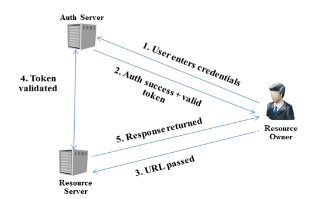

# spring-oauth
Using JWT with Spring Security OAuth

In this quick example we'll focus on setting up simple Spring Security OAuth2 project to use JSON Web Tokens (JWT). The application we’re going to build out will consist of three modules:

* Authorization Server
* Resource Server
* Web Application

The simple project uses the implicit grant. The diagram below represents the flow used int this case:

